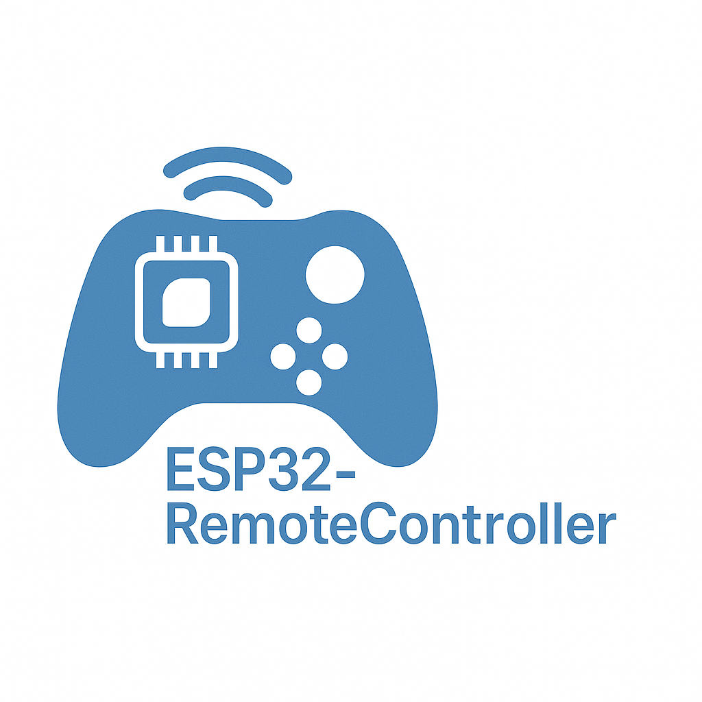

 

# ESP32-RemoteController

基于 ESP32-Wroom 微控制器的项目开发平台，集成 FreeRTOS 实时操作系统和 ESP-IDF/Arduino 开发框架，提供了一个灵活的远程控制解决方案。

`RAM:   13.4% (used 43760 bytes from 327680 bytes)`
`Flash: 23.3% (used 732909 bytes from 3145728 bytes)`
`Building .pio\build\esp32dev\firmware.bin`
`esptool.py v4.5.1`

